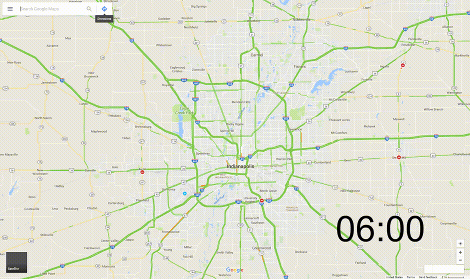

# commute analyzer

This is a quick tool that was put together to analyze the commute from various locations.  The main use was for tracking the commute from a number of different possible housing options to a single, known job.  At a high level, this project uses `puppeteer` for creating the screenshots of Google Maps with traffic and directions and `ffmpeg` for stitching those images together into a movie.

## usage

If you want to give this a whirl, you will need to do the usual `npm install` or `yarn` to update packages.  If you want to generate the movies, you will need to install `ffmpeg` separately and ensure that its executable is on your path.

Once those steps are done, you can run the main code using `node index.js`.  If you want to make movies of your screenshots, run the movie maker using `node movie-maker.js`.

Once you have all the packages installed, there are two other considerations:

- Change the time and interval of screenshot gathering
- Update the actual links used for the traffic and directions

The first item is straight forward, you can change the cron style scheduling to set how frequently and when to update.  Note that the current setting is `0 */10 4,5,6,14,15,16 * * *` which accounts for a timezone shift between where I am (Mountain Time) and where I wanted commute info (Eastern Time).

Setting the screenshots to grab is also simple, but is based on a convention right now.  There is an object whose keys name the specific information being grabbed.  It is expected to contain an array as the value with 2 entries.  The first entry will be used for the morning commute and the second entry is used for the evening commute.  In my examples, there is an `overview` entry which is simply the traffic map with no directions on it; I duplicate that entry since it's the same link for morning and evening.  There are also `traffic` entries which contain links for the drive to work first and then the flipped direction for the drive home.

## how it works

The screenshot creator works by using `puppeteer`, the headless version of Chromium.  TODO: detail

The movie maker works by using `ffmpeg` through a node wrapper library.  TODO: detail

## dependencies

The following packages were used.  Included is a brief description of why:

| package           | where       | reason                                                          |
| ----------------- | ----------- | --------------------------------------------------------------- |
| `fluent-ffmpeg`   | movie maker | wrapper library for easy access to ffmpeg                       |
| `glob`            | movie maker | file globbing to process screenshots                            |
| `jimp`            | movie maker | image processing library to add text to images                  |
| `moment`          | movie maker | time processing and formatting                                  |
| `moment-timezone` | movie maker | time zone conversion                                            |
| `multistream`     | movie maker | concat multiple PNG image streams into single stream for ffmpeg |
| `node-schedule`   | screenshot  | cron style scheduler for node used to fire off the screenshots  |
| `puppeteer`       | screenshot  | headless Chromium used to load webpage and take screenshot      |
